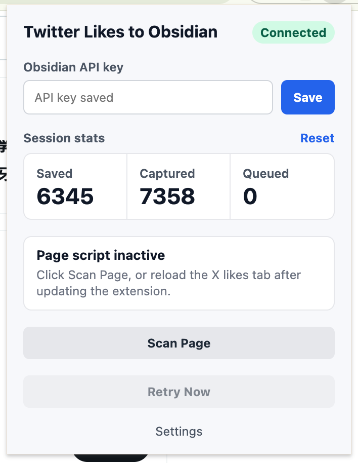

# Twitter Likes to Obsidian

A Chrome Manifest V3 extension that captures tweets from your X/Twitter likes page and saves them into an Obsidian vault through the Obsidian Local REST API.

The extension runs entirely in the browser. There is no companion server.



## What It Does

- Watches `x.com/*/likes` and `twitter.com/*/likes` while you scroll.
- Extracts liked tweet text, author details, timestamps, media, quoted tweets, reply context, videos, and article cards when available.
- Saves liked tweets into monthly Obsidian archive notes.
- Downloads tweet images and video thumbnails into vault assets.
- Deduplicates tweets with embedded tweet ID markers.
- Queues failed saves and retries them automatically.
- Provides a popup for API key setup, connection status, session stats, manual scanning, retry, and reset.

## Obsidian Output

Tweets are saved into monthly notes:

```text
wzh-twitter/monthly/YYYY/YYYY-MM.md
```

Media is saved under year/month-scoped asset folders:

```text
wzh-twitter/assets/YYYY/YYYY-MM/
```

Twitter articles, when detected and fetchable, are saved separately:

```text
wzh-twitter/articles/{article_id}.md
```

Each tweet entry includes an HTML marker such as:

```markdown
<!-- tweet_id: 1912345678901234567 -->
```

That marker is used to avoid saving the same liked tweet twice.

## Requirements

- Chrome or another Chromium-based browser that supports Manifest V3 extensions.
- Obsidian with the Local REST API community plugin installed and running.
- An Obsidian Local REST API key.
- Local REST API available at:

```text
http://127.0.0.1:27123
```

## Installation

1. Clone or download this repository.
2. Open `chrome://extensions`.
3. Enable **Developer mode**.
4. Click **Load unpacked**.
5. Select this project directory.
6. Open the extension popup and paste your Obsidian Local REST API key.

## Usage

1. Start Obsidian and make sure the Local REST API plugin is running.
2. Open your X/Twitter likes page, for example:

```text
https://x.com/{username}/likes
```

3. Scroll through your likes.
4. The extension captures visible tweets as they load and saves them to Obsidian.
5. Use the popup to check connection status, view session counts, scan the current page manually, or retry queued saves.

## Project Structure

```text
manifest.json          Chrome extension manifest
background.js          Service worker for Obsidian saves, queueing, and stats
content.js             Likes-page observer and scan orchestration
popup.html             Extension popup UI
popup.css              Popup styles
popup.js               Popup behavior
lib/extractor.js       Tweet DOM extraction
lib/markdown.js        Obsidian markdown generation
lib/obsidian-api.js    Local REST API client
lib/queue.js           Retry queue storage
lib/dedup.js           Tweet/article dedup helpers
lib/article.js         Twitter article extraction
lib/tweet-detail.js    Tweet detail enrichment
icons/                 Extension icons
```

## Development

This project is plain JavaScript and does not currently require a build step.

After editing files, reload the unpacked extension from `chrome://extensions`, then refresh any open X/Twitter tab so the latest content script is used.

## Notes

- The extension only captures tweets that appear in the browser DOM, so keep scrolling to load more likes.
- If Obsidian or the Local REST API is unavailable, captured tweets are added to the retry queue.
- X/Twitter changes its DOM often, so extraction may need maintenance over time.
